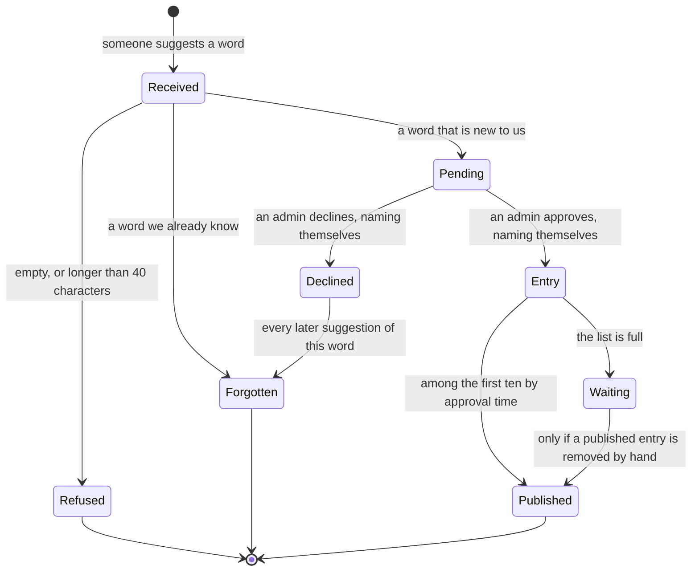

# The life of a suggestion

## What the suggester sees

**Refused** is the only outcome a suggester can tell apart, and only because they typed
something obviously wrong: too long, or nothing at all.

**Forgotten**, **Pending**, **Entry**, **Waiting**, **Published** and **Declined** all look
identical from outside — an acceptance, and then silence. A suggester cannot distinguish
"queued for review", "published this morning", "we already had it" and "declined in June".
This is the whole point of `decisions/0002-silent-drop-for-declined-text.md`, and it is the
reason we cannot add a "your word is in the queue" message without reopening that decision.

## What the admin sees

The pending queue, and nothing else. An admin cannot see declined words, cannot undo a
decision, and cannot remove a published entry. Undoing means editing the data file by hand,
which has happened perhaps three times and is annoying but rare enough that we have left it
alone.
